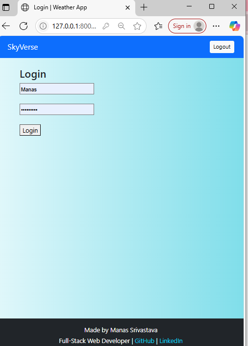
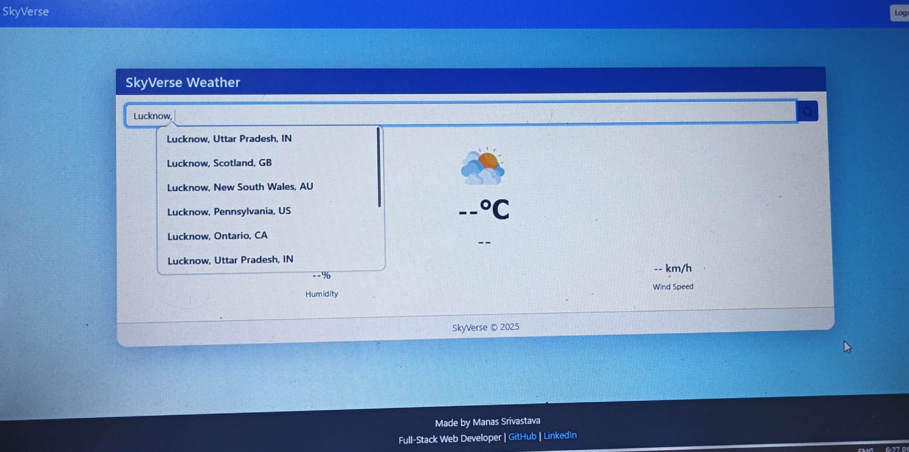

# 🌦️ SkyVerse Weather App

SkyVerse is a Django-based weather application that allows users to get real-time weather updates by entering a city name. It includes login/logout functionality and a responsive UI.

## 🚀 Features

- User Login/Logout
- Live weather data using OpenWeatherMap API
- Responsive and modern UI
- City name autocomplete

## 🖼️ Screenshots

### 🔐 Login Page

### 🌤️ Home Page - Card View

### 🌦️ Home Page - After Search

## 🛠️ Tech Stack

- **Python**
- **Django**
- **HTML/CSS**
- **JavaScript**
- **Bootstrap 5**
